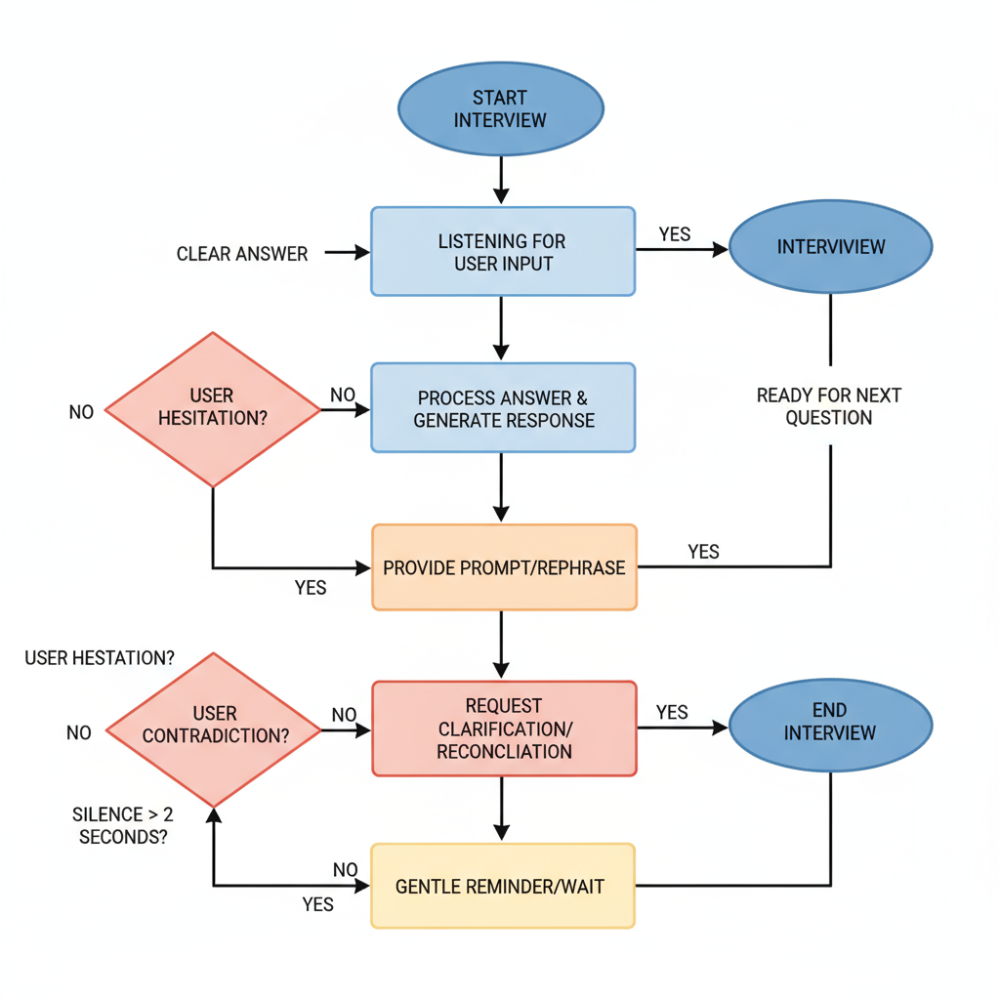

# Bonus Challenge: Agentic Flow Diagram

This diagram illustrates the interaction flow of an AI agent conducting an interview, detailing the states and transitions based on user responses.

## State Diagram (Mermaid Syntax)

stateDiagram-v2
[] --> Listening
Listening --> Prompting: if silence > 2s
Listening --> Clarifying: if contradiction
Listening --> Confirming: if hesitation
Listening --> NextQuestion: if clear answer
Prompting --> Listening
Clarifying --> Listening
Confirming --> Listening
NextQuestion --> []

## JSON Representation

The included `agentic_flow.json` file describes the same states, signals, and actions in a machine-readable format:

{
"states": ["Listening", "Prompting", "Clarifying", "Confirming", "NextQuestion"],
"signals": {
"silence": "Prompting",
"hesitation": "Confirming",
"contradiction": "Clarifying",
"clear_answer": "NextQuestion"
},
"actions": {
"Prompting": "Repeat the question politely after 2 seconds of silence",
"Clarifying": "Point out inconsistency and re-ask the question",
"Confirming": "Request more detail or evidence for clarification",
"NextQuestion": "Move smoothly to the next topic or question"
}
}

## Visual Diagram

Below is the visual representation of the agentic flow:

## Flow Explanation

- **Listening:** The AI listens for the candidate’s answers.
- **Prompting:** If silence lasts over 2 seconds, the AI politely prompts for an answer.
- **Clarifying:** If a contradiction is detected, the AI asks for clarification.
- **Confirming:** If hesitation is detected, the AI confirms the candidate’s intent or requests more details.
- **NextQuestion:** If an answer is clear, the AI moves to the next interview question.

## Included Files

- `agentic_flow.json`: The machine-readable JSON representation of the flow diagram.
- `agentic_flow.png`: The visual diagram image file.

Ensure both these files are included in this folder for completeness and ease of reference.